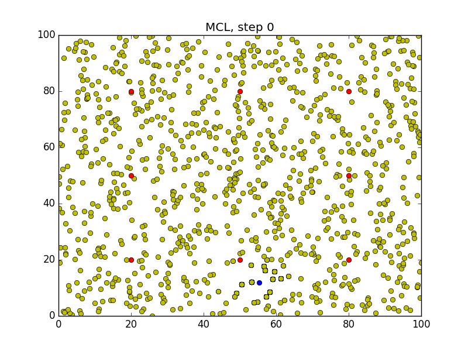
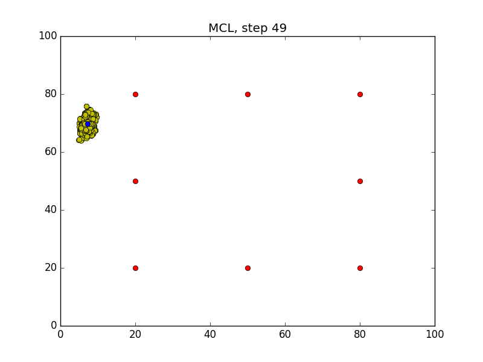

# MCL
Monte Carlo Localization Algorithm


## Description
You will be able to observe the `MCL` in action through the generated images. 


## Build & Run
Make sure you have opencv installed locally
```sh
$ cd /home/workspace/
$ git clone https://github.com/Ch3ck/MCL.git
$ cd MCL/
$ rm -rf Images/*
$ g++ mcl.cpp -o mcl -std=c++11 -I/usr/include/python3.7 -lpython3.7 # or make
$ ./mcl
```
Wait for the program to iterate `50` times.

## Errors

1. "/usr/local/include/numpy/ndarrayobject.h:11:10: fatal error: 'Python.h' file not found #include <Python.h>"
```
Fix: export CFLAGS="-I /usr/local/lib/python3.7/site-packages/numpy/core/include $CFLAGS"
```

2. fatal error: 'Python.h'
```
Fix: <Python/Python.h>
```
## Generated Images
After running the program, `50` images will be generated in the `Images` folder.
### Step0

### Step49

